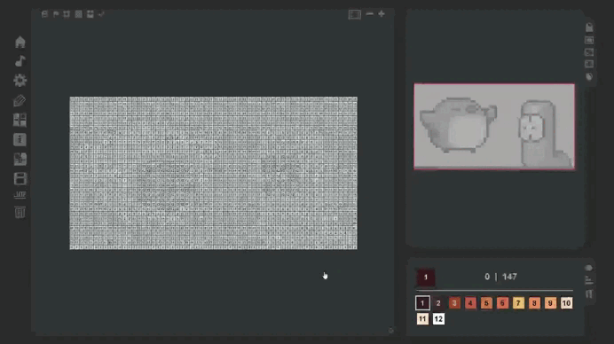

# Bot Colorin Game
## Bot de Coloriage Automatique pour Coloring Game
## Description

Ce script Python automatise le processus de coloriage dans un jeu spécifique. Il utilise OpenCV pour le traitement d'image, PyAutoGUI pour simuler des actions de souris et du clavier, et NumPy pour les opérations numériques.
### Fonctionnalités
* **Capture d'écran:** Capture une zone spécifique de l'écran pour analyse.
* **Détection de cellules:** Divise l'image capturée en cellules et les compare à des templates.
* **Simulation de clics:** Simule des clics de souris pour colorier les cellules correspondantes.
* **Personnalisation:** Les couleurs, les tailles de cellules et d'autres paramètres peuvent être ajustés dans le code.

## Installation
**Prérequis:**
* Python (3.6+)
* Les bibliothèques suivantes :
  * OpenCV
  * NumPy
  * PyAutoGUI
  * Pillow
  * keyboard

## Coloring Game

## en collaboration avec [Marius](https://github.com/Mhivelin)

## Extrait
